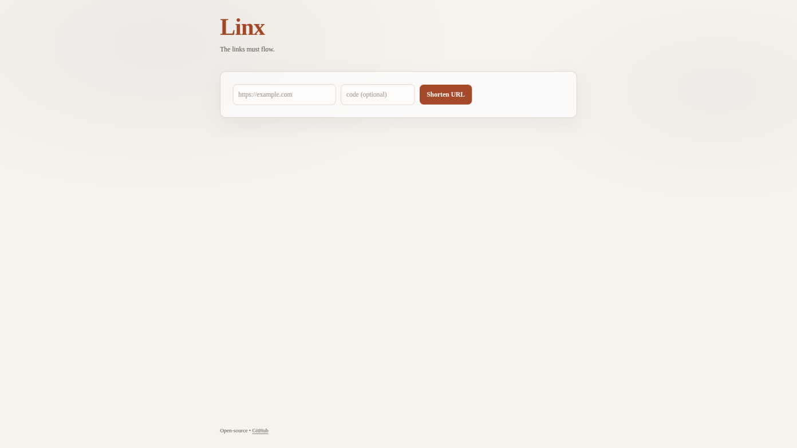
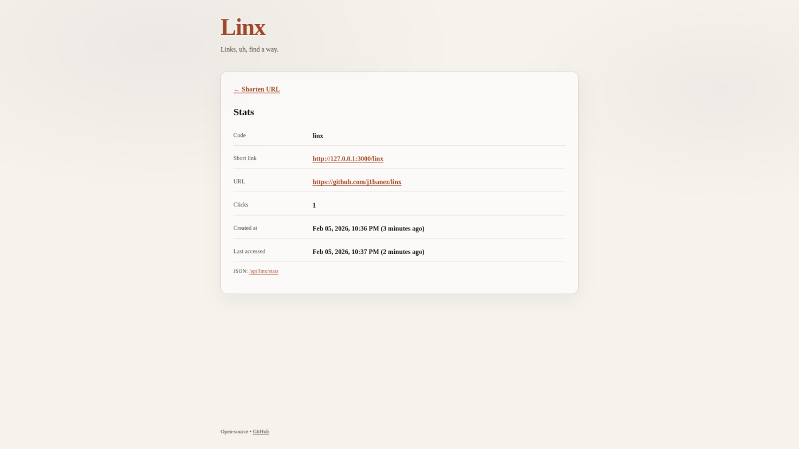

# Linx

[](https://github.com/j1banez/linx/actions/workflows/docker.yml)
[](https://github.com/j1banez/linx/pkgs/container/linx)

Linx is a simple, lightweight, self-hosted URL shortener.

## ⚡ Quick start

### Run with Docker (recommended)

```sh
docker run -d \
  --name linx \
  -p 3000:3000 \
  -v linx_data:/data \
  -e LINX_URL="https://your.domain" \
  ghcr.io/j1banez/linx:latest
```

Then open http://localhost:3000 in your browser.

Linx stores its data in a local SQLite database located at /data/linx.db
(persisted using a Docker volume).

Alternatively, use docker compose:

```yaml
services:
  linx:
    image: ghcr.io/j1banez/linx:latest
    container_name: linx
    ports:
      - "3000:3000"
    environment:
      LINX_URL: "https://your.domain"
    volumes:
      - linx_data:/data
    restart: unless-stopped

volumes:
  linx_data:
```

### Run from source

```sh
git clone https://github.com/j1banez/linx.git
cd linx
LINX_URL=https://your.domain cargo run
```

## ⚙️ Configuration

### Environment variables

| Variable        | Required | Default                         | Description |
|-----------------|----------|---------------------------------|-------------|
| `LINX_URL`      | no       | `http://127.0.0.1:3000`         | Public base URL used to generate short links. This should match how users access the service (domain, port, https, etc.). |
| `DATABASE_URL`  | no       | docker: `sqlite:///data/linx.db`, source: `sqlite://./linx.db` | SQLite database location. Use a volume to persist data when running in Docker. |
| `CODE_LEN`      | no       | `6`                             | Default short code length (allowed range 4-32). |
| `RUST_LOG`      | no       | `info`                          | Log level (e.g. `debug`, `info`, `warn`, `error`). |

## ✨ Features

- Shorten URLs, allow base62 custom codes
- Basic stats: click counter and last-access date
- Minimal web UI plus JSON API
- Zero config SQLite storage

## 🔐 Authentication

Linx does **not** implement authentication.

Do it at the reverse proxy layer (Traefik / Nginx / Caddy / Apache), or via your SSO gateway (Authelia, Authentik, Keycloak, etc.).

## 🧩 API

- `GET /api/health`
  - Returns `ok`.
- `POST /api/shorten`
  - Request body:
    ```json
    {"url":"https://example.com","code":"custom"}
    ```
  - `code` is optional; if omitted, a random one is generated.
  - Response:
    ```json
    {"short_url":"https://your.domain/AbC123","code":"AbC123"}
    ```
- `GET /api/{code}/stats`
  - Response:
    ```json
    {
      "code":"AbC123",
      "url":"https://example.com/",
      "clicks":12,
      "created_at":1700000000,
      "last_accessed_at":1700000100
    }
    ```

## 📸 Screenshots





## ❓ FAQ

>Is Linx multi-user?

Not yet. It's designed for single-owner/self-hosted use.

>Why is the click counter not working?

Browsers cache redirections when using http code 301 or 308 so if the same client
clicks multiple time, the counter will only update the first time.
